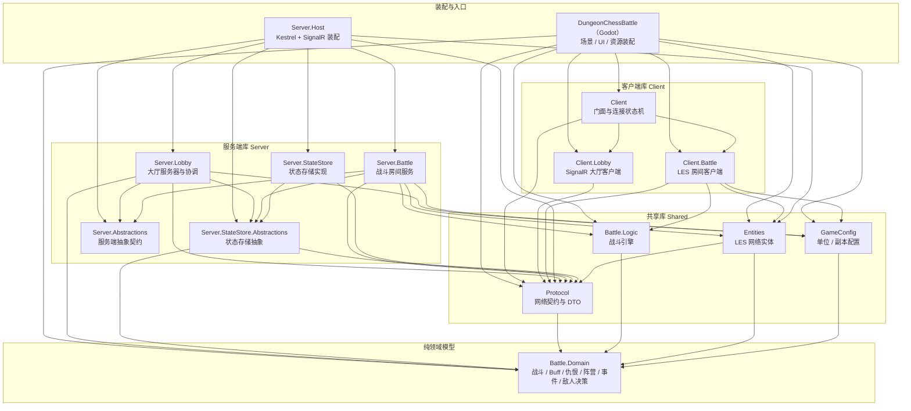

# DungeonChessBattle 总体架构

客户端使用 Godot 4.7 C#，游戏服务器为独立 .NET 子进程，大厅走 SignalR，战斗走 LiteNetLib + LiteEntitySystem 实体同步。

本文档只说明项目划分与项目职责。

## 解决方案划分

下图按实际 `ProjectReference` 依赖方向从上到下分层，`A --> B` 表示 A 依赖 B；底层为纯领域、中间为库、上层为装配与入口。



## LES 集成约定：逻辑阶段与回滚边界

跨项目共用的 LiteEntitySystem 时序与可回滚性约束，所有实体与编排代码必须遵守。

```
每个逻辑 tick（服务端）：
  ① 输入注入   LocalSingleton.Update            只写输入载体，移动方向与请求入队
  ② 输入落盘   OnLogicTick → ApplyIncomingInput 写入 UnitController.CurrentInput
  ③ 实体结算   entity.Update()                  唯一可回滚位置：读输入写可回滚 SyncVar
  ④ 编排推进   LocalSingleton.LateUpdate        BattleEngine.Tick：读条、伤害、冷却，服务端权威
  ⑤ 同步       tick 末发送 diff / baseline
```

约束：

- 预测回滚只重放客户端本地受控实体的 `Update()`。
- LocalSingleton、`VisualUpdate()`、构造回调永不参与回滚，禁止写入实体确定性状态。
- 唯一参与客户端预测与回滚的实体是本地受控的 `UnitPawn`。
- 技能、读条、Buff、伤害全部服务端权威，客户端经可靠请求通道，不做预测。
- LocalSingleton 阶段允许服务端权威副作用（如移动打断读条），客户端不预测不重放，只消费同步结果。
- 移动结算的唯一入口是 `UnitPawn.Update()`。
- 会话连接状态是服务端本地数据，存放于 `PlayerSession`，不放入网络实体。

## 项目文档索引

| 项目 | 职责 | 文档 |
| --- | --- | --- |
| `DungeonChessBattle` | Godot 主工程：场景、UI、资源装配与网络驱动 | [01-dungeonchessbattle](functional_boundary/01-dungeonchessbattle.md) |
| `DungeonChessBattle.Client` | 网络客户端门面 `GameClientService` 与连接状态机 | [02-client](functional_boundary/02-client.md) |
| `DungeonChessBattle.Client.Lobby` | SignalR 大厅客户端 `LobbyClient` | [03-client-lobby](functional_boundary/03-client-lobby.md) |
| `DungeonChessBattle.Client.Battle` | LES 房间客户端 `RoomBattleClient` | [04-client-battle](functional_boundary/04-client-battle.md) |
| `DungeonChessBattle.Protocol` | 网络契约：Hub 方法名、DTO、字段长度约束、端口与协议默认值 | [05-protocol](functional_boundary/05-protocol.md) |
| `DungeonChessBattle.Battle.Domain` | 纯领域模型：战斗、Buff、仇恨、移动、阵营、事件、敌人决策 | [06-battle-domain](functional_boundary/06-battle-domain.md) |
| `DungeonChessBattle.Battle.Logic` | 战斗引擎 `BattleEngine` 与 Buff、仇恨、移动逻辑 | [07-battle-logic](functional_boundary/07-battle-logic.md) |
| `DungeonChessBattle.Entities` | LES 网络实体与类型注册表 | [08-entities](functional_boundary/08-entities.md) |
| `DungeonChessBattle.GameConfig` | 单位 / 副本配置库 | [09-gameconfig](functional_boundary/09-gameconfig.md) |
| `DungeonChessBattle.Server.StateStore.Abstractions` | 状态存储接口与快照模型 | [10-statestore-abstractions](functional_boundary/10-statestore-abstractions.md) |
| `DungeonChessBattle.Server.StateStore` | 内存状态存储实现 | [11-statestore](functional_boundary/11-statestore.md) |
| `DungeonChessBattle.Server.Abstractions` | 服务端抽象契约：房间生命周期与广播端口 | [15-server-abstractions](functional_boundary/15-server-abstractions.md) |
| `DungeonChessBattle.Server.Lobby` | 大厅服务器：Hub 端点、业务与协调 | [12-server-lobby](functional_boundary/12-server-lobby.md) |
| `DungeonChessBattle.Server.Battle` | 战斗房间服务与生命周期 | [13-server-battle](functional_boundary/13-server-battle.md) |
| `DungeonChessBattle.Server.Host` | Kestrel + SignalR 装配与进程入口 | [14-server-host](functional_boundary/14-server-host.md) |


