# DungeonChessBattle 总体架构

客户端使用 Godot 4.7 C#，游戏服务器为独立 .NET 子进程，大厅走 SignalR，战斗走 LiteNetLib + LiteEntitySystem 实体同步。

本文档只说明项目划分与项目职责。

## 解决方案划分

`A --> B` 表示 A 依赖 B，边与实际 `ProjectReference` 一一对应。分组维度是域，与项目名前缀无关：`Server.DataStore` 归 datastore，`Server.Abstractions` 与 `Server.Host` 归 server，`Battle.Client` 归 battle，`Lobby.Client` 归 lobby。

```mermaid
graph TD
    subgraph DGodot["godot：主工程装配与表现"]
        Godot["Game（Godot）<br>场景 / UI / 资源装配"]
        GameMod["Game.Mod<br>mod 管理 / 展示装配 / 资源加载与入口"]
        GameShared["Game.Shared<br>展示层共享契约（视图 / 加载端口 / 索引）"]
    end

    subgraph DClient["client：客户端装配与契约"]
        Client["Client<br>门面与连接状态机"]
        ClientShared["Client.Shared<br>客户端连接契约"]
    end

    subgraph DBattle["battle：战斗世界、房间服务、在线端与配置登记"]
        Shared["Battle.Shared<br>契约与数据结构（战斗 / Buff / 仇恨 / 阵营 / 事件 / 敌人决策）"]
        Logic["Battle.Logic<br>战斗世界"]
        Entities["Battle.Entities<br>LES 网络实体"]
        GameConfig["GameConfig<br>单位 / 副本配置"]
        BattleMod["Battle.Mod<br>mod 内容契约 / 目录装载与指纹 / 接口注册"]
        BattleClient["Battle.Client<br>LES 房间客户端"]
        BattleSrv["Battle.Server<br>战斗房间服务"]
    end

    subgraph DLobby["lobby：大厅与大厅客户端"]
        LobbyShared["Lobby.Shared<br>大厅共享值类型（房间状态）"]
        LobbyProtocol["Lobby.Protocol<br>大厅网络契约（Hub 方法名与 DTO）"]
        LobbyClient["Lobby.Client<br>SignalR 大厅客户端"]
        LobbySrv["Lobby.Server<br>大厅服务器与协调"]
    end

    subgraph DStore["datastore：状态存储与身份凭证"]
        StoreAbst["Server.DataStore.Shared<br>数据存储抽象"]
        Store["Server.DataStore<br>数据存储实现"]
    end

    subgraph DReplay["replay：回放子系统"]
        Replay["Replay<br>回放引擎"]
        ReplayShared["Replay.Shared<br>回放记录格式与容器契约"]
        ReplayProtocol["Replay.Protocol<br>回放 HTTP 契约（DTO / 路由 / 序列化）"]
        ReplayCli["Replay.Client<br>回放获取：HTTP 传输"]
        ReplaySrv["Replay.Server<br>回放 HTTP 端点：列表 / 下载 / 凭证鉴权"]
    end

    subgraph DServer["server：服务端装配与契约"]
        ServerAbst["Server.Abstractions<br>服务端抽象契约"]
        Host["Server.Host<br>Kestrel + SignalR 装配"]
    end

    %% Game
    Godot --> LobbyShared
    Godot --> LobbyProtocol
    Godot --> Client
    Godot --> BattleClient
    Godot --> GameConfig
    Godot --> Logic
    Godot --> Entities
    Godot --> Shared
    Godot --> Replay
    Godot --> ReplayShared
    Godot --> ReplayProtocol
    Godot --> ReplayCli
    Godot --> GameMod
    Godot --> GameShared

    %% mod 契约：数据面由 GameConfig 与 Game.Mod 各自消费，行为端口在 Shared
    BattleMod --> Shared
    GameConfig --> BattleMod
    GameMod --> BattleMod
    GameMod --> GameConfig
    GameMod --> GameShared

    %% client 域：门面组装两端，只给上层抽象
    Client --> LobbyClient
    Client --> BattleClient
    Client --> ClientShared
    Client --> Entities
    Client --> LobbyProtocol

    %% battle 域：在线端与服务端共用领域与配置
    BattleClient --> ClientShared
    BattleClient --> Logic
    BattleClient --> Entities
    BattleClient --> GameConfig
    Logic --> Shared
    Entities --> Shared
    GameConfig --> Shared
    BattleSrv --> Shared
    BattleSrv --> Logic
    BattleSrv --> Entities
    BattleSrv --> GameConfig
    BattleSrv --> ServerAbst
    BattleSrv --> StoreAbst
    BattleSrv --> ReplayShared

    %% lobby 域：大厅客户端与业务
    LobbyClient --> ClientShared
    LobbyClient --> LobbyProtocol
    LobbyProtocol --> LobbyShared
    LobbySrv --> LobbyShared
    LobbySrv --> LobbyProtocol
    LobbySrv --> Shared
    LobbySrv --> GameConfig
    LobbySrv --> ServerAbst
    LobbySrv --> StoreAbst

    %% datastore 域：契约只依赖大厅值类型，实现再依赖领域常量与契约层
    StoreAbst --> LobbyShared
    Store --> LobbyShared
    Store --> Shared
    Store --> GameConfig
    Store --> ServerAbst
    Store --> StoreAbst

    %% replay 域
    ReplayShared --> Shared
    ReplayProtocol --> ReplayShared
    ReplayCli --> ReplayProtocol
    Replay --> Shared
    Replay --> Logic
    Replay --> GameConfig
    Replay --> ReplayShared
    ReplaySrv --> ReplayProtocol
    ReplaySrv --> ReplayShared
    ReplaySrv --> ServerAbst

    %% server 域：Host 是装配根，向下依赖各域实现
    Host --> ServerAbst
    Host --> Entities
    Host --> LobbySrv
    Host --> BattleSrv
    Host --> ReplaySrv
    Host --> Store
    Host --> StoreAbst
```

## 项目文档索引

文档分层与维护规则见 [00-index](00-index.md)：`functional_boundary/` 一模块一篇写边界，`overview/` 一域一篇写机制，`flow/` 一链一篇写跨模块时序。

`functional_boundary` 的文件名 slug 为 `编号-项目名小写`，编号即模块身份；跨文档引用只写编号路径（如 `functional_boundary/04`），不写 slug，改 slug 无需动正文。

| 项目                                         | 职责                                                         | 边界描述                                                                        | 域机制                                 |
| -------------------------------------------- | ------------------------------------------------------------ | ------------------------------------------------------------------------------- | -------------------------------------- |
| `DungeonChessBattle.Game`                    | Godot 主工程：场景、UI、资源装配与网络驱动                   | [01-game](functional_boundary/01-game.md)                                       | [godot](overview/godot.md)             |
| `DungeonChessBattle.Client`                  | 网络客户端门面 `GameClientService` 与连接状态机              | [02-client](functional_boundary/02-client.md)                                   | [client](overview/client.md)           |
| `DungeonChessBattle.Client.Shared`           | 客户端连接契约：`IClientConnection` 最小连接抽象             | [20-client-shared](functional_boundary/20-client-shared.md)                     | [client](overview/client.md)           |
| `DungeonChessBattle.Battle.Shared`           | 契约与数据结构：战斗、Buff、仇恨、移动、阵营、事件、敌人决策 | [06-battle-shared](functional_boundary/06-battle-shared.md)                     | [battle](overview/battle.md)           |
| `DungeonChessBattle.Battle.Logic`            | 战斗世界 `BattleScene` 与 Buff、施法校验、仇恨、移动逻辑      | [07-battle-logic](functional_boundary/07-battle-logic.md)                       | [battle](overview/battle.md)           |
| `DungeonChessBattle.Battle.Entities`         | LES 网络实体与类型注册表                                     | [08-battle-entities](functional_boundary/08-battle-entities.md)                 | [battle](overview/battle.md)           |
| `DungeonChessBattle.Battle.GameConfig`        | 单位 / 副本配置与内容侧逻辑实现：效果、公式、敌人决策        | [09-gameconfig](functional_boundary/09-gameconfig.md)                           | [battle](overview/battle.md)           |
| `DungeonChessBattle.Battle.Mod`              | mod 内容装载契约：清单 / schema / 装载与启用集 / 行为注册接口 | [24-battle-mod](functional_boundary/24-battle-mod.md)                          | [mod](overview/mod.md)                 |
| `DungeonChessBattle.Game.Mod`                | mod 管理、展示数据装配、资源加载与统一获取入口               | [25-game-mod](functional_boundary/25-game-mod.md)                              | [mod](overview/mod.md)                 |
| `DungeonChessBattle.Game.Shared`             | 展示层共享契约：视图 / 加载端口 / 统一索引                   | [26-game-shared](functional_boundary/26-game-shared.md)                        | [mod](overview/mod.md)                 |
| `DungeonChessBattle.Battle.Client`           | LES 房间客户端 `RoomBattleClient`                            | [04-battle-client](functional_boundary/04-battle-client.md)                     | [battle](overview/battle.md)           |
| `DungeonChessBattle.Battle.Server`           | 战斗房间服务与生命周期                                       | [13-battle-server](functional_boundary/13-battle-server.md)                     | [battle](overview/battle.md)           |
| `DungeonChessBattle.Lobby.Shared`            | 大厅共享值类型：房间状态枚举                                 | [17-lobby-shared](functional_boundary/17-lobby-shared.md)                       | [lobby](overview/lobby.md)             |
| `DungeonChessBattle.Lobby.Protocol`          | 大厅网络契约：Hub 端点路径 `HubPaths`、方法名与大厅 DTO    | [19-lobby-protocol](functional_boundary/19-lobby-protocol.md)                   | [lobby](overview/lobby.md)             |
| `DungeonChessBattle.Lobby.Client`            | SignalR 大厅客户端 `LobbyClient`                             | [03-lobby-client](functional_boundary/03-lobby-client.md)                       | [lobby](overview/lobby.md)             |
| `DungeonChessBattle.Lobby.Server`            | 大厅服务器：Hub 端点、业务与协调                             | [12-lobby-server](functional_boundary/12-lobby-server.md)                       | [lobby](overview/lobby.md)             |
| `DungeonChessBattle.Server.DataStore.Shared` | 数据存储接口与快照模型                                       | [10-server-datastore-shared](functional_boundary/10-server-datastore-shared.md) | [datastore](overview/datastore.md)     |
| `DungeonChessBattle.Server.DataStore`        | 内存数据存储实现                                             | [11-server-datastore](functional_boundary/11-server-datastore.md)               | [datastore](overview/datastore.md)     |
| `DungeonChessBattle.Replay.Shared`           | 回放记录格式契约：记录模型、编解码与分块容器读写             | [18-replay-shared](functional_boundary/18-replay-shared.md)                     | [replay](overview/replay.md)           |
| `DungeonChessBattle.Replay.Protocol`         | 回放 HTTP 契约：DTO、路由与序列化约定                        | [23-replay-protocol](functional_boundary/23-replay-protocol.md)                 | [replay](overview/replay.md)           |
| `DungeonChessBattle.Replay`                  | 回放引擎 `ReplayEngine`，回放子系统重放端                    | [16-replay](functional_boundary/16-replay.md)                                   | [replay](overview/replay.md)           |
| `DungeonChessBattle.Replay.Client`           | 回放获取侧：HTTP 传输，缓存/解码/门控/并集在 Game 层浏览服务 | [22-replay-client](functional_boundary/22-replay-client.md)                     | [replay](overview/replay.md)           |
| `DungeonChessBattle.Replay.Server`           | 回放服务侧：列表与下载的 HTTP 端点、会话凭证鉴权             | [21-replay-server](functional_boundary/21-replay-server.md)                     | [replay](overview/replay.md)           |
| `DungeonChessBattle.Server.Abstractions`     | 服务端抽象契约：房间生命周期与广播端口                       | [15-server-abstractions](functional_boundary/15-server-abstractions.md)         | [server](overview/server.md)           |
| `DungeonChessBattle.Server.Host`             | Kestrel + SignalR 装配与进程入口                             | [14-server-host](functional_boundary/14-server-host.md)                         | [server](overview/server.md)           |

