# DungeonChessBattle 总体架构

客户端使用 Godot 4.7 C#，游戏服务器为独立 .NET 子进程，大厅走 SignalR，战斗走 LiteNetLib + LiteEntitySystem 实体同步。

本文档只说明项目划分与项目职责。

## 解决方案划分

项目命名：`域.层`（`Battle.Client`、`Lobby.Server`、`Replay.Protocol`）；单段名是装配、入口或配置（`Game`、`Client`、`Replay`、`GameConfig`）。下图的分层与模块文档的「所属分组」按层聚合（Client / Server / Shared），与项目名首段的域无关。

下图按实际 `ProjectReference` 依赖方向从上到下分层，`A --> B` 表示 A 依赖 B；底层为契约与数据结构、中间为库、上层为装配与入口。

```mermaid
graph TD
    subgraph AppLayer["装配与入口"]
        Host["Server.Host<br>Kestrel + SignalR 装配"]
        Godot["Game（Godot）<br>场景 / UI / 资源装配"]
    end

    subgraph ClientLayer["客户端库 Client"]
        Client["Client<br>门面与连接状态机"]
        LobbyClient["Lobby.Client<br>SignalR 大厅客户端"]
        BattleClient["Battle.Client<br>LES 房间客户端"]
        ReplayCli["Replay.Client<br>回放获取：HTTP 传输"]
    end

    subgraph ServerLayer["服务端库 Server"]
        LobbySrv["Lobby.Server<br>大厅服务器与协调"]
        BattleSrv["Battle.Server<br>战斗房间服务"]
        ReplaySrv["Replay.Server<br>回放 HTTP 端点：列表 / 下载 / 凭证鉴权"]
        Store["Server.DataStore<br>数据存储实现"]
        StoreAbst["Server.DataStore.Shared<br>数据存储抽象"]
        ServerAbst["Server.Abstractions<br>服务端抽象契约"]
    end

    subgraph SharedLayer["共享库 Shared"]
        LobbyShared["Lobby.Shared<br>大厅共享值类型（房间状态）"]
        LobbyProtocol["Lobby.Protocol<br>大厅网络契约（Hub 方法名与 DTO）"]
        ReplayProtocol["Replay.Protocol<br>回放 HTTP 契约（DTO / 路由 / 序列化）"]
        ClientShared["Client.Shared<br>客户端连接契约"]
        Logic["Battle.Logic<br>战斗世界"]
        Entities["Battle.Entities<br>LES 网络实体"]
        GameConfig["GameConfig<br>单位 / 副本配置"]
        Replay["Replay<br>回放引擎"]
        ReplayShared["Replay.Shared<br>回放记录格式与归档契约"]
    end

    subgraph ModelLayer["契约与数据结构"]
        Shared["Battle.Shared<br>契约与数据结构（战斗 / Buff / 仇恨 / 阵营 / 事件 / 敌人决策）"]
    end

    Godot --> LobbyShared
    Godot --> Client
    Godot --> BattleClient
    Godot --> Replay
    Godot --> ReplayCli
    Godot --> ReplayShared
    Godot --> LobbyProtocol
    Godot --> Logic
    Godot --> Entities
    Godot --> GameConfig
    Godot --> Shared

    Client --> LobbyClient
    Client --> BattleClient
    Client --> ClientShared
    Client --> Entities
    Client --> LobbyProtocol
    LobbyClient --> ClientShared
    LobbyClient --> LobbyProtocol
    BattleClient --> ClientShared
    BattleClient --> Logic
    BattleClient --> Entities
    BattleClient --> GameConfig
    ReplayCli --> ReplayProtocol
    ReplayCli --> ReplayShared
    Replay --> Logic
    Replay --> Shared
    Replay --> GameConfig
    Replay --> ReplayShared

    Host --> LobbySrv
    Host --> BattleSrv
    Host --> ReplaySrv
    Host --> Store
    Host --> StoreAbst
    Host --> ServerAbst
    Host --> Entities

    LobbySrv --> ServerAbst
    LobbySrv --> StoreAbst
    LobbySrv --> GameConfig
    LobbySrv --> Shared
    LobbySrv --> LobbyProtocol
    BattleSrv --> ServerAbst
    BattleSrv --> StoreAbst
    BattleSrv --> Logic
    BattleSrv --> Entities
    BattleSrv --> GameConfig
    BattleSrv --> Shared
    BattleSrv --> ReplayShared
    ReplaySrv --> ServerAbst
    ReplaySrv --> ReplayProtocol

    Store --> StoreAbst
    Store --> ServerAbst
    Store --> Shared
    Store --> LobbyShared
    StoreAbst --> LobbyShared

    LobbyProtocol --> LobbyShared
    ReplayProtocol --> ReplayShared
    LobbySrv --> LobbyShared
    Logic --> Shared
    Entities --> Shared
    GameConfig --> Shared
    GameConfig --> Logic
```

## 项目文档索引

文档分层与维护规则见 [00-index](00-index.md)：`functional_boundary/` 一模块一篇写边界，`overview/` 一域一篇写机制，`flow/` 一链一篇写跨模块时序。

`functional_boundary` 的文件名 slug 为 `编号-项目名小写`，编号即模块身份；跨文档引用只写编号路径（如 `functional_boundary/04`），不写 slug，改 slug 无需动正文。

| 项目 | 职责 | 边界描述 | 域机制 |
| --- | --- | --- | --- |
| `DungeonChessBattle.Game` | Godot 主工程：场景、UI、资源装配与网络驱动 | [01-game](functional_boundary/01-game.md) | [godot](overview/godot.md) |
| `DungeonChessBattle.Client` | 网络客户端门面 `GameClientService` 与连接状态机 | [02-client](functional_boundary/02-client.md) | [client](overview/client.md) |
| `DungeonChessBattle.Lobby.Client` | SignalR 大厅客户端 `LobbyClient` | [03-lobby-client](functional_boundary/03-lobby-client.md) | [client](overview/client.md) |
| `DungeonChessBattle.Battle.Client` | LES 房间客户端 `RoomBattleClient` | [04-battle-client](functional_boundary/04-battle-client.md) | [client](overview/client.md) |
| `DungeonChessBattle.Replay` | 回放引擎 `ReplayEngine`，回放子系统重放端 | [16-replay](functional_boundary/16-replay.md) | [replay](overview/replay.md) |
| `DungeonChessBattle.Replay.Server` | 回放服务侧：列表与下载的 HTTP 端点、会话凭证鉴权 | [21-replay-server](functional_boundary/21-replay-server.md) | [replay](overview/replay.md) |
| `DungeonChessBattle.Replay.Client` | 回放获取侧：HTTP 传输，缓存/解码/门控/并集在 Game 层浏览服务 | [22-replay-client](functional_boundary/22-replay-client.md) | [replay](overview/replay.md) |
| `DungeonChessBattle.Replay.Protocol` | 回放 HTTP 契约：DTO、路由与序列化约定 | [23-replay-protocol](functional_boundary/23-replay-protocol.md) | [replay](overview/replay.md) |
| `DungeonChessBattle.Lobby.Shared` | 大厅共享值类型：房间状态枚举 | [17-lobby-shared](functional_boundary/17-lobby-shared.md) | [lobby](overview/lobby.md) |
| `DungeonChessBattle.Lobby.Protocol` | 大厅网络契约：Hub 方法名与大厅 DTO | [19-lobby-protocol](functional_boundary/19-lobby-protocol.md) | [lobby](overview/lobby.md) |
| `DungeonChessBattle.Replay.Shared` | 回放记录格式契约：记录模型、编解码与归档存储抽象 | [18-replay-shared](functional_boundary/18-replay-shared.md) | [replay](overview/replay.md) |
| `DungeonChessBattle.Client.Shared` | 客户端连接契约：`IClientConnection` 最小连接抽象 | [20-client-shared](functional_boundary/20-client-shared.md) | [client](overview/client.md) |
| `DungeonChessBattle.Battle.Shared` | 契约与数据结构：战斗、Buff、仇恨、移动、阵营、事件、敌人决策 | [06-battle-shared](functional_boundary/06-battle-shared.md) | [battle](overview/battle.md) |
| `DungeonChessBattle.Battle.Logic` | 战斗世界 `BattleScene` 与 Buff、仇恨、移动逻辑 | [07-battle-logic](functional_boundary/07-battle-logic.md) | [battle](overview/battle.md) |
| `DungeonChessBattle.Battle.Entities` | LES 网络实体与类型注册表 | [08-battle-entities](functional_boundary/08-battle-entities.md) | [battle](overview/battle.md) |
| `DungeonChessBattle.GameConfig` | 单位 / 副本配置库 | [09-gameconfig](functional_boundary/09-gameconfig.md) | [battle](overview/battle.md) |
| `DungeonChessBattle.Server.DataStore.Shared` | 数据存储接口与快照模型 | [10-server-datastore-shared](functional_boundary/10-server-datastore-shared.md) | [lobby](overview/lobby.md) |
| `DungeonChessBattle.Server.DataStore` | 内存数据存储实现 | [11-server-datastore](functional_boundary/11-server-datastore.md) | [lobby](overview/lobby.md) |
| `DungeonChessBattle.Server.Abstractions` | 服务端抽象契约：房间生命周期与广播端口 | [15-server-abstractions](functional_boundary/15-server-abstractions.md) | [server](overview/server.md) |
| `DungeonChessBattle.Lobby.Server` | 大厅服务器：Hub 端点、业务与协调 | [12-lobby-server](functional_boundary/12-lobby-server.md) | [lobby](overview/lobby.md) |
| `DungeonChessBattle.Battle.Server` | 战斗房间服务与生命周期 | [13-battle-server](functional_boundary/13-battle-server.md) | [battle](overview/battle.md) |
| `DungeonChessBattle.Server.Host` | Kestrel + SignalR 装配与进程入口 | [14-server-host](functional_boundary/14-server-host.md) | [server](overview/server.md) |

