# DungeonChessBattle 总体架构

客户端为主工程进程，游戏服务器为独立 .NET 子进程；大厅走长连接通道，战斗走实时传输与实体同步。

本文档给出项目划分与依赖关系。

## 解决方案划分

`A --> B` 表示 A 依赖 B，边与实际项目引用一一对应。分组维度是域，与项目名前缀无关：`Server.DataStore` 归 datastore，`Server.Host` 归 server，`Battle.Client` 归 battle，`Lobby.Client` 归 lobby。

```mermaid
graph TD
    subgraph DEngine["engine：主工程装配与表现"]
        Engine["Game<br>场景 / UI / 资源装配"]
        GameMod["Game.Mod.Manager<br>mod 管理 / 展示装配 / 注册表实现"]
        GameIface["Game.Mod.Interface<br>mod 开发锚点：要实现的入口接口"]
        GameModShared["Game.Mod.Shared<br>展示接口：条目读写口 / 装配上下文 / 表现接口"]
        GameShared["Game.Shared<br>mod 与宿主共用的展示形状：展示数据"]
    end

    subgraph DClient["client：客户端装配与接口"]
        Client["Client<br>门面与连接状态机"]
    end

    subgraph DBattle["battle：战斗世界、房间服务、在线端与配置登记"]
        Shared["Battle.Shared<br>共用形状：身份键 / 数据形状 / 行为端口 / 只读视图"]
        Config["Battle.Config.Shared<br>静态配置数据：内容定义 / 注册表查找口"]
        Runtime["Battle.Runtime.Shared<br>运行时对象：单位权威状态 / 装配 / 意图 / 展示视图"]
        Logic["Battle.Logic<br>战斗世界"]
        Entities["Battle.Entities<br>实体同步网络实体"]
        ConfigRegistry["Config.Registry<br>内容注册表 / 登记点"]
        BattleMod["Battle.Mod.Manager<br>mod 目录装载 / 启用集 / 内容指纹 / 内容装配"]
        BattleModIface["Battle.Mod.Interface<br>mod 入口接口：要实现的数据入口"]
        BattleModShared["Battle.Mod.Shared<br>数据面注册面定义：内容注册口 / 引导上下文"]
        BattleClient["Battle.Client<br>实体同步房间客户端"]
        BattleSrv["Battle.Server<br>战斗房间服务"]
        BattleSrvShared["Battle.Server.Shared<br>战斗域服务端接口"]
    end

    subgraph DLobby["lobby：大厅与大厅客户端"]
        LobbyShared["Lobby.Shared<br>大厅共享值类型：房间状态"]
        LobbyProtocol["Lobby.Protocol<br>大厅协议：端点方法名与 DTO"]
        LobbyClient["Lobby.Client<br>长连接大厅客户端"]
        LobbySrv["Lobby.Server<br>大厅服务器与协调"]
    end

    subgraph DStore["datastore：状态存储与身份凭证"]
        StoreAbst["Server.DataStore.Shared<br>数据存储抽象"]
        Store["Server.DataStore<br>数据存储实现"]
    end

    subgraph DReplay["replay：回放子系统"]
        Replay["Replay<br>回放引擎"]
        ReplayShared["Replay.Shared<br>回放记录格式与容器定义"]
        ReplayProtocol["Replay.Protocol<br>回放 HTTP 协议：DTO / 路由 / 序列化"]
        ReplayCli["Replay.Client<br>回放获取：HTTP 传输"]
        ReplaySrv["Replay.Server<br>回放 HTTP 端点：列表 / 下载 / 凭证鉴权"]
    end

    subgraph DServer["server：服务端装配与接口"]
        Host["Server.Host<br>服务端宿主装配"]
    end

    %% engine 域：主工程装配与表现
    Engine --> LobbyShared
    Engine --> LobbyProtocol
    Engine --> Client
    Engine --> BattleClient
    Engine --> ConfigRegistry
    Engine --> Logic
    Engine --> Entities
    Engine --> Shared
    Engine --> Config
    Engine --> Runtime
    Engine --> Replay
    Engine --> ReplayShared
    Engine --> ReplayProtocol
    Engine --> ReplayCli
    Engine --> GameMod
    Engine --> GameModShared
    Engine --> GameShared

    %% mod 接口：mod 只见 Interface，注册面定义经其传递可见
    BattleModIface --> BattleModShared
    BattleModShared --> Config
    GameMod --> BattleMod
    BattleMod --> ConfigRegistry
    BattleMod --> BattleModIface
    GameMod --> Shared
    GameMod --> Config
    GameMod --> GameIface
    GameMod --> GameModShared
    GameMod --> GameShared
    GameIface --> GameModShared
    GameModShared --> GameShared
    GameShared --> Shared

    %% client 域：门面组装两端，只给上层抽象
    Client --> LobbyClient
    Client --> BattleClient
    Client --> Entities
    Client --> LobbyProtocol
    Client --> Config

    %% battle 域：在线端与服务端共用领域与配置
    BattleClient --> Logic
    BattleClient --> Entities
    BattleClient --> Shared
    BattleClient --> Config
    BattleClient --> Runtime
    Logic --> Shared
    Logic --> Config
    Logic --> Runtime
    Entities --> Shared
    Entities --> Runtime
    Config --> Shared
    Runtime --> Shared
    Runtime --> Config
    ConfigRegistry --> Shared
    ConfigRegistry --> Config
    BattleSrv --> Shared
    BattleSrv --> Config
    BattleSrv --> Runtime
    BattleSrv --> Logic
    BattleSrv --> Entities
    BattleSrv --> ConfigRegistry
    BattleSrv --> BattleSrvShared
    BattleSrv --> StoreAbst
    BattleSrv --> ReplayShared

    %% lobby 域：大厅客户端与业务
    LobbyClient --> LobbyProtocol
    LobbyProtocol --> LobbyShared
    LobbySrv --> LobbyShared
    LobbySrv --> LobbyProtocol
    LobbySrv --> Shared
    LobbySrv --> Config
    LobbySrv --> ConfigRegistry
    LobbySrv --> BattleSrvShared
    LobbySrv --> StoreAbst

    %% datastore 域：接口只依赖大厅值类型，实现再依赖领域常量与接口层
    StoreAbst --> LobbyShared
    Store --> LobbyShared
    Store --> Shared
    Store --> StoreAbst

    %% replay 域
    ReplayShared --> Shared
    ReplayProtocol --> ReplayShared
    ReplayCli --> ReplayProtocol
    Replay --> Shared
    Replay --> Config
    Replay --> Runtime
    Replay --> Logic
    Replay --> ConfigRegistry
    Replay --> ReplayShared
    ReplaySrv --> ReplayProtocol
    ReplaySrv --> ReplayShared
    ReplaySrv --> StoreAbst

    %% server 域：Host 是装配根，向下依赖各域实现
    Host --> BattleMod
    Host --> ConfigRegistry
    Host --> BattleSrvShared
    Host --> Entities
    Host --> LobbySrv
    Host --> BattleSrv
    Host --> ReplaySrv
    Host --> Store
    Host --> StoreAbst
```

## 项目文档索引

文档分层与维护规则见 [docs-rules](../docs-rules.md)。

下表按依赖图的域分组，给出各模块的边界文档。

| 模块                                         | 域        | 边界文档                                                                  |
| -------------------------------------------- | --------- | ------------------------------------------------------------------------- |
| `DungeonChessBattle.Game`                    | engine    | [game](functional_boundary/game.md)                                       |
| `DungeonChessBattle.Client`                  | client    | [client](functional_boundary/client.md)                                   |
| `DungeonChessBattle.Battle.Config.Shared`    | battle    | [battle-config-shared](functional_boundary/battle-config-shared.md)       |
| `DungeonChessBattle.Battle.Shared`           | battle    | [battle-shared](functional_boundary/battle-shared.md)                     |
| `DungeonChessBattle.Battle.Runtime.Shared`   | battle    | [battle-runtime-shared](functional_boundary/battle-runtime-shared.md)     |
| `DungeonChessBattle.Battle.Logic`            | battle    | [battle-logic](functional_boundary/battle-logic.md)                       |
| `DungeonChessBattle.Battle.Entities`         | battle    | [battle-entities](functional_boundary/battle-entities.md)                 |
| `DungeonChessBattle.Battle.Config.Registry`  | battle    | [battle-config-registry](functional_boundary/battle-config-registry.md)   |
| `DungeonChessBattle.Battle.Mod.Manager`      | battle    | [battle-mod-manager](functional_boundary/battle-mod-manager.md)           |
| `DungeonChessBattle.Battle.Mod.Interface`    | battle    | [battle-mod-interface](functional_boundary/battle-mod-interface.md)       |
| `DungeonChessBattle.Battle.Mod.Shared`       | battle    | [battle-mod-shared](functional_boundary/battle-mod-shared.md)             |
| `DungeonChessBattle.Game.Mod.Manager`        | engine    | [game-mod-manager](functional_boundary/game-mod-manager.md)               |
| `DungeonChessBattle.Game.Mod.Interface`      | engine    | [game-mod-interface](functional_boundary/game-mod-interface.md)           |
| `DungeonChessBattle.Game.Mod.Shared`         | engine    | [game-mod-shared](functional_boundary/game-mod-shared.md)                 |
| `DungeonChessBattle.Game.Shared`             | engine    | [game-shared](functional_boundary/game-shared.md)                         |
| `DungeonChessBattle.Battle.Client`           | battle    | [battle-client](functional_boundary/battle-client.md)                     |
| `DungeonChessBattle.Battle.Server`           | battle    | [battle-server](functional_boundary/battle-server.md)                     |
| `DungeonChessBattle.Battle.Server.Shared`    | battle    | [battle-server-shared](functional_boundary/battle-server-shared.md)       |
| `DungeonChessBattle.Lobby.Shared`            | lobby     | [lobby-shared](functional_boundary/lobby-shared.md)                       |
| `DungeonChessBattle.Lobby.Protocol`          | lobby     | [lobby-protocol](functional_boundary/lobby-protocol.md)                   |
| `DungeonChessBattle.Lobby.Client`            | lobby     | [lobby-client](functional_boundary/lobby-client.md)                       |
| `DungeonChessBattle.Lobby.Server`            | lobby     | [lobby-server](functional_boundary/lobby-server.md)                       |
| `DungeonChessBattle.Server.DataStore.Shared` | datastore | [server-datastore-shared](functional_boundary/server-datastore-shared.md) |
| `DungeonChessBattle.Server.DataStore`        | datastore | [server-datastore](functional_boundary/server-datastore.md)               |
| `DungeonChessBattle.Replay.Shared`           | replay    | [replay-shared](functional_boundary/replay-shared.md)                     |
| `DungeonChessBattle.Replay.Protocol`         | replay    | [replay-protocol](functional_boundary/replay-protocol.md)                 |
| `DungeonChessBattle.Replay`                  | replay    | [replay](functional_boundary/replay.md)                                   |
| `DungeonChessBattle.Replay.Client`           | replay    | [replay-client](functional_boundary/replay-client.md)                     |
| `DungeonChessBattle.Replay.Server`           | replay    | [replay-server](functional_boundary/replay-server.md)                     |
| `DungeonChessBattle.Server.Host`             | server    | [server-host](functional_boundary/server-host.md)                         |

