# DungeonChessBattle 总体架构

客户端使用 Godot 4.7 C#，游戏服务器为独立 .NET 子进程，大厅走 SignalR，战斗走 LiteNetLib + LiteEntitySystem 实体同步。

本文档只说明项目划分与项目职责。

## 解决方案划分

`A --> B` 表示 A 依赖 B，边与实际 `ProjectReference` 一一对应。分组维度是域，与项目名前缀无关：`Server.DataStore` 归 datastore，`Server.Host` 归 server，`Battle.Client` 归 battle，`Lobby.Client` 归 lobby。

```mermaid
graph TD
    subgraph DGodot["godot：主工程装配与表现"]
        Godot["Game（Godot）<br>场景 / UI / 资源装配"]
        GameMod["Game.Mod.Manager<br>mod 管理 / 展示装配 / 注册表实现"]
        GameIface["Game.Mod.Interface<br>mod 开发锚点：要实现的入口契约"]
        GameModShared["Game.Mod.Shared<br>展示契约：条目读写口 / 装配上下文 / 表现契约"]
        GameShared["Game.Shared<br>mod 与宿主共用的展示形状：展示数据"]
    end

    subgraph DClient["client：客户端装配与契约"]
        Client["Client<br>门面与连接状态机"]
    end

    subgraph DBattle["battle：战斗世界、房间服务、在线端与配置登记"]
        Shared["Battle.Shared<br>契约与数据结构（战斗 / Buff / 仇恨 / 阵营 / 事件 / 敌人决策 / 行为 ID）"]
        Logic["Battle.Logic<br>战斗世界"]
        Entities["Battle.Entities<br>LES 网络实体"]
        GameConfig["GameConfig<br>内容注册表 / 行为目录 / 登记点"]
        BattleMod["Battle.Mod.Manager<br>mod 目录装载 / 启用集 / 内容指纹 / ALC / 内容装配"]
        BattleModIface["Battle.Mod.Interface<br>mod 入口契约：要实现 IModEntry"]
        BattleModShared["Battle.Mod.Shared<br>数据面注册面定义：行为注册 / 内容注册 / 合成口"]
        BattleClient["Battle.Client<br>LES 房间客户端"]
        BattleSrv["Battle.Server<br>战斗房间服务"]
        BattleSrvShared["Battle.Server.Shared<br>战斗域服务端契约"]
    end

    subgraph DLobby["lobby：大厅与大厅客户端"]
        LobbyShared["Lobby.Shared<br>大厅共享值类型（房间状态）"]
        LobbyProtocol["Lobby.Protocol<br>大厅网络契约（Hub 方法名与 DTO）"]
        LobbyClient["Lobby.Client<br>SignalR 大厅客户端"]
        LobbySrv["Lobby.Server<br>大厅服务器与协调"]
    end

    subgraph DStore["datastore：状态存储与身份凭证"]
        StoreAbst["Server.DataStore.Shared<br>数据存储抽象"]
        Store["Server.DataStore<br>数据存储实现"]
    end

    subgraph DReplay["replay：回放子系统"]
        Replay["Replay<br>回放引擎"]
        ReplayShared["Replay.Shared<br>回放记录格式与容器契约"]
        ReplayProtocol["Replay.Protocol<br>回放 HTTP 契约（DTO / 路由 / 序列化）"]
        ReplayCli["Replay.Client<br>回放获取：HTTP 传输"]
        ReplaySrv["Replay.Server<br>回放 HTTP 端点：列表 / 下载 / 凭证鉴权"]
    end

    subgraph DServer["server：服务端装配与契约"]
        Host["Server.Host<br>Kestrel + SignalR 装配"]
    end

    %% Game
    Godot --> LobbyShared
    Godot --> LobbyProtocol
    Godot --> Client
    Godot --> BattleClient
    Godot --> GameConfig
    Godot --> Logic
    Godot --> Entities
    Godot --> Shared
    Godot --> Replay
    Godot --> ReplayShared
    Godot --> ReplayProtocol
    Godot --> ReplayCli
    Godot --> GameMod
    Godot --> GameModShared
    Godot --> GameShared

    %% mod 契约：mod 只见 Interface，注册面定义经其传递可见
    BattleModIface --> BattleModShared
    BattleModShared --> Shared
    GameMod --> BattleMod
    BattleMod --> GameConfig
    BattleMod --> BattleModIface
    GameMod --> Shared
    GameMod --> GameIface
    GameMod --> GameModShared
    GameMod --> GameShared
    GameIface --> GameModShared
    GameModShared --> GameShared

    %% client 域：门面组装两端，只给上层抽象
    Client --> LobbyClient
    Client --> BattleClient
    Client --> Entities
    Client --> LobbyProtocol

    %% battle 域：在线端与服务端共用领域与配置
    BattleClient --> Logic
    BattleClient --> Entities
    BattleClient --> GameConfig
    Logic --> Shared
    Entities --> Shared
    GameConfig --> Shared
    BattleSrv --> Shared
    BattleSrv --> Logic
    BattleSrv --> Entities
    BattleSrv --> GameConfig
    BattleSrv --> BattleSrvShared
    BattleSrv --> StoreAbst
    BattleSrv --> ReplayShared

    %% lobby 域：大厅客户端与业务
    LobbyClient --> LobbyProtocol
    LobbyProtocol --> LobbyShared
    LobbySrv --> LobbyShared
    LobbySrv --> LobbyProtocol
    LobbySrv --> Shared
    LobbySrv --> GameConfig
    LobbySrv --> BattleSrvShared
    LobbySrv --> StoreAbst

    %% datastore 域：契约只依赖大厅值类型，实现再依赖领域常量与契约层
    StoreAbst --> LobbyShared
    Store --> LobbyShared
    Store --> Shared
    Store --> StoreAbst

    %% replay 域
    ReplayShared --> Shared
    ReplayProtocol --> ReplayShared
    ReplayCli --> ReplayProtocol
    Replay --> Shared
    Replay --> Logic
    Replay --> GameConfig
    Replay --> ReplayShared
    ReplaySrv --> ReplayProtocol
    ReplaySrv --> ReplayShared
    ReplaySrv --> StoreAbst

    %% server 域：Host 是装配根，向下依赖各域实现
    Host --> BattleMod
    Host --> BattleSrvShared
    Host --> Entities
    Host --> LobbySrv
    Host --> BattleSrv
    Host --> ReplaySrv
    Host --> Store
    Host --> StoreAbst
```

## 项目文档索引

文档分层与维护规则见 [docs-rules](../docs-rules.md)：`functional_boundary/` 一模块一篇写边界，`overview/` 一域一篇写机制，`flow/` 一链一篇写跨模块时序。

`functional_boundary` 的文件名 slug 为 `项目名小写`（如 `battle-logic`），文件名即模块身份；跨文档引用与 `overview`/`flow` 一致，只写目录与文件名，不写锚点、不拆编号。

| 项目                                         | 职责                                                                       | 边界描述                                                                  |
| -------------------------------------------- | -------------------------------------------------------------------------- | ------------------------------------------------------------------------- |
| `DungeonChessBattle.Game`                    | Godot 主工程：场景、UI、资源装配与网络驱动                                 | [game](functional_boundary/game.md)                                       |
| `DungeonChessBattle.Client`                  | 网络客户端门面 `GameClientService` 与连接状态机                            | [client](functional_boundary/client.md)                                   |
| `DungeonChessBattle.Battle.Shared`           | 契约与数据结构：战斗、Buff、仇恨、移动、阵营、事件、敌人决策、行为 ID      | [battle-shared](functional_boundary/battle-shared.md)                     |
| `DungeonChessBattle.Battle.Logic`            | 战斗世界 `BattleScene` 与 Buff、施法校验、仇恨、移动逻辑                   | [battle-logic](functional_boundary/battle-logic.md)                       |
| `DungeonChessBattle.Battle.Entities`         | LES 网络实体与类型注册表                                                   | [battle-entities](functional_boundary/battle-entities.md)                 |
| `DungeonChessBattle.Battle.GameConfig`       | 内容配置：定义注册表 / 行为目录 / 单位与副本登记点 / 战斗单位装配          | [gameconfig](functional_boundary/gameconfig.md)                           |
| `DungeonChessBattle.Battle.Mod.Manager`      | mod 包管理与数据面装配：包布局 / 清单与启用集 / 装载排序 / 指纹 / 装配引导 | [battle-mod-manager](functional_boundary/battle-mod-manager.md)           |
| `DungeonChessBattle.Battle.Mod.Interface`    | mod 入口契约：mod 要实现 `IModEntry`                                       | [battle-mod-interface](functional_boundary/battle-mod-interface.md)       |
| `DungeonChessBattle.Battle.Mod.Shared`       | 数据面注册面定义：行为注册 / 内容注册 / 合成口                             | [battle-mod-shared](functional_boundary/battle-mod-shared.md)             |
| `DungeonChessBattle.Game.Mod.Manager`        | mod 管理、展示装配全过程、注册表实现与统一获取入口                         | [game-mod-manager](functional_boundary/game-mod-manager.md)               |
| `DungeonChessBattle.Game.Mod.Interface`      | mod 开发锚点：只放 mod 要实现的入口 `IModDisplayEntry`                     | [game-mod-interface](functional_boundary/game-mod-interface.md)           |
| `DungeonChessBattle.Game.Mod.Shared`         | 展示契约：条目读写口 / 装配上下文 / 表现契约                                | [game-mod-shared](functional_boundary/game-mod-shared.md)                 |
| `DungeonChessBattle.Game.Shared`             | mod 与宿主共用的展示形状：四表展示数据                                     | [game-shared](functional_boundary/game-shared.md)                         |
| `DungeonChessBattle.Battle.Client`           | LES 房间客户端 `RoomBattleClient`                                          | [battle-client](functional_boundary/battle-client.md)                     |
| `DungeonChessBattle.Battle.Server`           | 战斗房间服务与生命周期                                                     | [battle-server](functional_boundary/battle-server.md)                     |
| `DungeonChessBattle.Battle.Server.Shared`    | 战斗域服务端契约：房间生命周期管理端口                                     | [battle-server-shared](functional_boundary/battle-server-shared.md)       |
| `DungeonChessBattle.Lobby.Shared`            | 大厅共享值类型：房间状态枚举                                               | [lobby-shared](functional_boundary/lobby-shared.md)                       |
| `DungeonChessBattle.Lobby.Protocol`          | 大厅网络契约：Hub 端点路径 `HubPaths`、方法名与大厅 DTO                    | [lobby-protocol](functional_boundary/lobby-protocol.md)                   |
| `DungeonChessBattle.Lobby.Client`            | SignalR 大厅客户端 `LobbyClient`                                           | [lobby-client](functional_boundary/lobby-client.md)                       |
| `DungeonChessBattle.Lobby.Server`            | 大厅服务器：Hub 端点、业务与协调                                           | [lobby-server](functional_boundary/lobby-server.md)                       |
| `DungeonChessBattle.Server.DataStore.Shared` | 数据存储接口与快照模型、回放归档与身份解析端口                             | [server-datastore-shared](functional_boundary/server-datastore-shared.md) |
| `DungeonChessBattle.Server.DataStore`        | 内存数据存储实现                                                           | [server-datastore](functional_boundary/server-datastore.md)               |
| `DungeonChessBattle.Replay.Shared`           | 回放记录格式契约：记录模型、编解码与分块容器读写                           | [replay-shared](functional_boundary/replay-shared.md)                     |
| `DungeonChessBattle.Replay.Protocol`         | 回放 HTTP 契约：DTO、路由与序列化约定                                      | [replay-protocol](functional_boundary/replay-protocol.md)                 |
| `DungeonChessBattle.Replay`                  | 回放引擎 `ReplayEngine`，回放子系统重放端                                  | [replay](functional_boundary/replay.md)                                   |
| `DungeonChessBattle.Replay.Client`           | 回放获取侧：HTTP 传输，缓存/解码/门控/并集在 Game 层浏览服务               | [replay-client](functional_boundary/replay-client.md)                     |
| `DungeonChessBattle.Replay.Server`           | 回放服务侧：列表与下载的 HTTP 端点、会话凭证鉴权                           | [replay-server](functional_boundary/replay-server.md)                     |
| `DungeonChessBattle.Server.Host`             | Kestrel + SignalR 装配与进程入口                                           | [server-host](functional_boundary/server-host.md)                         |

