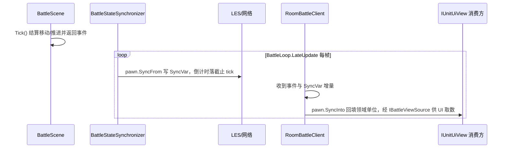

# 战斗状态同步

战斗权威状态的端到端同步链路：领域 → 投影 → 网络 → 领域回填 → UI，以及回放同契约消费。本文跨 `Battle.Logic`、`Battle.Entities`、`Battle.Client`、`Battle.Server`、`Replay` 多模块，描述整体工作方式。第三方库 LES 自身时序见 `libraries/lite-entity-system-update`，单模块职责见 `overview/04-battle-client`。在线端本地预测的框架调查与已知缺陷见 [client-prediction](client-prediction.md)。

## 单一真相源

权威状态由 `BattleScene`（`Battle.Logic`）持有的领域实体 `BattleUnit` 决定，服务端、在线与回放共用同一实现，不依赖网络载体。结算权威在服务端；在线端持本地 `BattleScene` 承载领域单位，下行值直接回填，当前不在在线端跑模拟。

## 同步通道

`UnitPawn.StateSync.cs` 是 `BattleUnit` ↔ `UnitPawn` 字段清单的唯一声明处，一对方向方法逐字段成对：

- `SyncFrom(BattleUnit)`：服务端权威投影（领域 → 载体）。`BattleStateSynchronizer` 由 `BattleLoop.LateUpdate` 在 `Tick` 之后逐单位调用，另写房间阶段；回放不投影（领域直读）。
- `SyncInto(BattleUnit)`：在线端回填（载体 → 领域）。`ClientBattleLoop.VisualUpdate` 每渲染帧按网络 ID 配对后调用。

调用方只做配对与调度，不出现字段清单；通道不设端别守卫，选向由调用点负责。倒计时字段在通道内双向闭合：领域侧恒为剩余秒，线上恒为截止 tick。字段清单曾分散在服务端投影器与客户端镜像两处，下行有值而领域无读数的缺口即由此产生；通道收拢后同类缺口换了形态——字段搬进了领域，推进者没跟着搬，见搬运规则末条。

## 搬运规则

- 计数型字段（生命、位置、半径、读条剩余等）直接写 SyncVar，靠 LES 做增量 diff。
- 冷却 / Buff / 仇恨 `SyncList`：服务端逐字段比对内容、一致则跳过重建，避免每帧全量发送；在线端按下行列表的内容指纹比对，指纹未变只跳过领域列表重建，条目剩余秒仍逐帧原地刷新。指纹归属回填的领域单位，换绑即失效，无需调用方重置。
- 倒计时字段写**截止 tick**（`EndServerTick`），不逐 tick 推当前值；回填侧按本端插值 `ServerTick` 反算剩余秒，换算只出现在通道内。剩余秒非正一律落哨兵 0，反算见 0 短路归零，不参与 tick 差值——写成当前 tick 等于每 tick 重定基，两端 tick 同步前进，反算出的差永不收敛。
- `MaxStacks`、`StackCount`、`DamageType` 等 Buff 字段随 Buff 条目一起写；在线端还原为 `ActiveBuff` 展示壳（`NetworkBuffDefinition`），不推进效果。
- 仇恨表与聚焦 ID 只下行不回填：在线端不跑仇恨结算与 AI，聚焦另有轮询。
- 每个剩余秒字段都要有推进者，且只在 `BattleScene.Tick` 内推进：读条 `SkillCastRemaining`、全局冷却 `GcdRemaining`、个体冷却 `CooldownEntry.Remaining`、`BuffInstance.Remaining` 各一处。截止 tick 是源剩余秒的派生量，源不推进则派生量逐 tick 重定基，本端读到一个恒定正数：显示上时间永不动，判定上冷却永不到期。

## 网络下发与客户端接收

- 通信走 LiteNetLib + LiteEntitySystem，协议头 `0xDC`。
- `OnNetworkReceiveInternal` 分流：
  - `ReliableMessageFrame` 可靠消息帧 → `BattleEventCoder` 解码为领域事件 → 存 `BattleEventLogStore` 并触发 `BattleEventsReceived`；
  - 其余 `0xDC` 帧 → `ClientEntityManager.Deserialize`。
- `EntityManager.Update()` 驱动 LES 实体同步与状态回放。

## 客户端战斗世界（下行回填领域）

在线端构建 `BattleScene` 承载领域单位，`UnitPawn` SyncVar 的 `Value` 每渲染帧回填 `BattleUnit`；UI 统一从领域 `BattleUnit`（实现 `IUnitUiView`/`ISkillCasterView`）取数。预测的框架调查与已知缺陷见 [client-prediction](client-prediction.md)。

### 回填字段集

位置/朝向、生命、最大生命、半径、速度与攻防系数、治疗强度、施法技能与读条剩余一律读写 `Value`；全局冷却、个体冷却与 Buff 的截止时间按截止 tick 反算为剩余秒，Buff 还原为展示壳。`UnitPawn` 未标 `SyncFlags.Interpolated`，LES 的 A/B 插值通道未启用（见 client-prediction 的 D9），回填读的是 `Value`。

### 每帧 `UpdateAfterPollEvents`

1. 副本键同步后 `EnsureBattleScene` 构建 `BattleScene`（本地 `PhysicsMovementScene`）；未同步随下一帧重试。
2. `EntityManager.Update()` 驱动 LES 同步，其间 `ClientBattleLoop.VisualUpdate` 逐领域单位配对网络载体调 `SyncInto` 回填；其 `Update`/`LateUpdate` 为空实现，在线端不跑本地结算。
3. 轮询 `FocusTargetNetId` 刷新本地聚焦映射。服务端维持"聚焦目标必存活"不变式，死亡不经事件通报，随生命值下行自愈。
4. 每秒流量结算；轮询房间阶段变化触发 `BattlePhaseChanged`。

实体创建回调 `OnPawnEntityCreated` 只登记 Pawn 并 `AddPawnUnit` 注册领域单位，**注册在前、`OnUnitCreated` 在后**，保证事件时刻领域单位已可查询。

### 截止 tick 换算

`SyncTickHelper.RemainingSeconds` 用客户端插值 `ServerTick` 与截止 tick 做 `SequenceDiff`（处理 16 位回绕）推算剩余秒数；服务端用自身 `Tick`。倒计时同步统一为截止 tick，避免逐帧推送当前值。

本端落后量（下行单程 + 插值水位 + 播放欠账 + 回填时点，即 client-prediction 的 D10）无法在本端消除：反算出的剩余秒恒比权威多 `落后 tick / Tickrate`，128 Hz 下约 0.1–0.2 秒。这是「传绝对时刻、本端推当前值」的固有代价，施法判定由服务端权威兜底，当前决定不补偿。

Buff 与冷却经回填进入领域 `RuntimeState`，在线端的技能冷却显示（`ButtonSkillBase`）据此取数，剩余秒每渲染帧按截止 tick 反算；冷却/Buff 列表由回填通道独占，在线端不得本地改写。在线端不判可否施放：按键即上行，可否施放与预输入排队由权威裁定。仇恨表无在线消费者，仅随投影下行。

## 领域单位 → UI

`RoomBattleClient.Units`（`BattleScene.BattleUnits`，`IReadOnlyList<IUnitUiView>`，仅枚举、主线程更新）经 `IClientBattleSession` 由门面 `RoomSession` 交出，再经 `BattleSessionContext.Units` 暴露；同一契约另给 `LocalUnit`（展示）与 `LocalFocus`（聚焦展示）。UI 组件每帧直读 `IUnitUiView` 字段。在线端不暴露施法判定角色：可否施放无本地裁定，`ISkillCasterView` 只在服务端与回放侧被消费。

## 契约分层

- `IWorldPoseView`：碰撞半径 + 逻辑位置，供判定。
- `ISkillCasterView : IUnitCombatView, IWorldPoseView`：施法判定最小子集，`SkillCastValidator` 依赖。
- `IUnitCombatView : IUnitIdentityView, ICombatValuesView, ISkillSource`：公共面，`ISkillCasterView` 与 `IUnitUiView` 共享。
- `IUnitUiView : IUnitCombatView`：展示契约，`Position` 与判定共用同一份位置读数（在线为下行回填值，回放为本地结算值），不再分离插值与权威两份。
- `IBattleUnitView : ISkillCasterView, ICombatStatsView, IHateActorView`：领域只读（服务端/AI/仇恨）。
- `IBuffUiView`：Buff 展示，`ActiveBuff` 实现它。

契约分层消除重复声明，UI 判定与展示各取所需。

## 回放链

`ReplayEngine` 构建 `BattleScene`（不投影）每帧确定性重跑：移动输入按记录帧经 `SubmitMove` 注入，施法输入经同一 `CastPreInputBuffer` 接管后交 `BattleScene.TryCast`；移动在 `BattleScene.Tick` 内与在线同序结算，直接读 `BattleUnit`（实现 `IUnitUiView`）供展示契约消费，无网络与投影层。

## 两链收敛

在线经「服务端领域 → `BattleUnit` → `UnitPawn.SyncFrom` → `UnitPawn` SyncVar → 网络 → 客户端 `UnitPawn.SyncInto` 回填本地 `BattleScene` → UI」，回放「服务端领域 → `BattleUnit` → 输入重放 → 本地结算 → UI」，最终都收敛到 `IUnitUiView`/`IBuffUiView`。差别在于回放每帧本地结算，在线直接显示下行读数。

## 断线 / 重连

客户端 `ClearRoomSessionState` 清空单位索引、聚焦、阶段与本地网络 ID，随连接状态重建为干净会话。

服务端侧单位载体不随玩家断开销毁：断开玩家的单位原地站桩，领域状态与投影照常推进下行，重连方按 `BaselineSync` 全量重建视图。解绑与输入归零的先后约束见 `overview/13-battle-server`。
