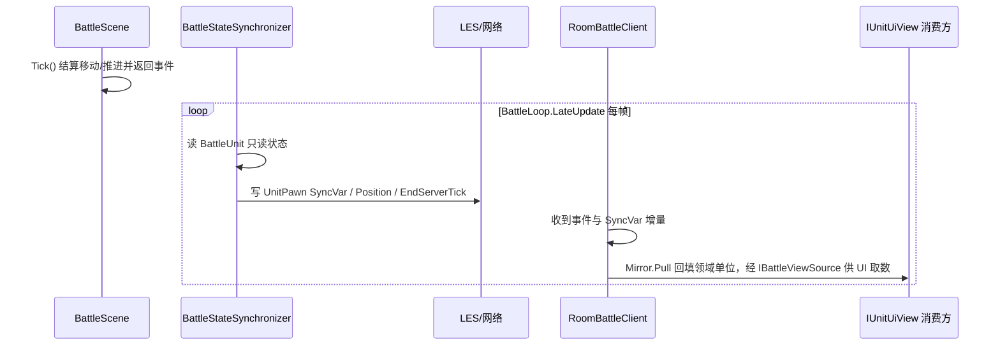

# 战斗状态同步

战斗权威状态的端到端同步链路：领域 → 投影 → 网络 → 客户端镜像 → UI，以及回放同契约消费。本文跨 `Battle.Logic`、`Battle.Entities`、`Client.Battle`、`Battle.Server`、`Replay` 多模块，描述整体工作方式。第三方库 LES 自身时序见 `libraries/lite-entity-system-update`，单模块职责见 `overview/04-client-battle`。在线端本地预测的框架调查与已知缺陷见 [client-prediction](client-prediction.md)。

## 单一真相源

权威状态由 `BattleScene`（`Battle.Logic`）持有的领域实体 `BattleUnit` 决定，服务端、在线与回放共用同一实现，不依赖网络载体。结算权威在服务端；在线端持本地 `BattleScene` 承载领域单位，下行值直接回填，当前不在在线端跑模拟。

## 投影契约

- `IProjectableBattleState`：供状态同步器读取领域只读状态（含位置/朝向）。
- 服务端 `BattleStateSynchronizer`：读 `BattleUnit`，写 `UnitPawn`（LES 实体）的 SyncVars 与房间阶段；回放不投影（领域直读）。

`BattleLoop.LateUpdate` 在 `Tick` 之后显式驱动 `BattleStateSynchronizer.Sync` 投影。

## 投影规则

- 计数型字段（生命、位置、半径、读条剩余等）直接写 SyncVar，靠 LES 做增量 diff。
- 冷却 / Buff / 仇恨等 `SyncList`：内容比对后节流重建，避免每帧全量发送。
- 倒计时字段写**截止 tick**（`EndServerTick`），不逐 tick 推当前值；两端各自推算剩余。
- `MaxStacks`、`StackCount`、`DamageType` 等 Buff 字段随 Buff 条目一起写。

## 网络下发与客户端接收

- 通信走 LiteNetLib + LiteEntitySystem，协议头 `0xDC`。
- `OnNetworkReceiveInternal` 分流：
  - `ReliableMessageFrame` 可靠消息帧 → `BattleEventCoder` 解码为领域事件 → 存 `BattleEventLogStore` 并触发 `BattleEventsReceived`；
  - 其余 `0xDC` 帧 → `ClientEntityManager.Deserialize`。
- `EntityManager.Update()` 驱动 LES 实体同步与状态回放。

## 客户端战斗世界（下行回填领域）

在线端构建 `BattleScene` 承载领域单位，`UnitPawn` SyncVar 的 `Value` 每渲染帧回填 `BattleUnit`；UI 统一从领域 `BattleUnit`（实现 `IUnitUiView`/`ISkillCasterView`）取数。预测的框架调查与已知缺陷见 [client-prediction](client-prediction.md)。

### 状态搬运 `BattleSceneMirror`

`Pull` 与 `Flush` 共用同一字段集：位置/朝向、生命、最大生命、半径、速度与攻防系数、治疗强度、施法技能与读条剩余一律读写 `Value`。`UnitPawn` 未标 `SyncFlags.Interpolated`，LES 的 A/B 插值通道未启用（见 client-prediction 的 D9）。当前只有 `Pull` 有调用点，`Flush` 未被调用。

### 每帧 `UpdateAfterPollEvents`

1. 副本键同步后 `EnsureBattleScene` 构建 `BattleScene`（本地 `PhysicsMovementScene`）；未同步随下一帧重试。
2. `EntityManager.Update()` 驱动 LES 同步，其间 `ClientBattleLoop.VisualUpdate` 每渲染帧 `Pull` 一次 SyncVar 读数回填领域单位；其 `Update`/`LateUpdate` 为空实现，在线端不跑本地结算。
3. 轮询 `FocusTargetNetId` 刷新本地聚焦映射。服务端维持"聚焦目标必存活"不变式，死亡不经事件通报，随生命值下行自愈。
4. 每秒流量结算；轮询房间阶段变化触发 `BattlePhaseChanged`。

实体创建回调 `OnPawnEntityCreated` 只登记 Pawn 并 `AddPawnUnit` 注册领域单位，**注册在前、`OnUnitCreated` 在后**，保证事件时刻领域单位已可查询。

### 截止 tick 换算

`SyncTickHelper.RemainingSeconds` 用客户端插值 `ServerTick` 与截止 tick 做 `SequenceDiff`（处理 16 位回绕）推算剩余秒数；服务端用自身 `Tick`。倒计时同步统一为截止 tick，避免逐帧推送当前值。

Buff / 冷却 / 仇恨三个 `SyncList` 与 `GcdEndServerTick` 现仅由服务端投影，在线端不消费，是待清理的下行冗余。

## 领域单位 → UI

`RoomBattleClient.Units`（`BattleScene.BattleUnits`，`IReadOnlyList<IUnitUiView>`，仅枚举、主线程更新）经 `BattleSessionContext.Units` 暴露；另提供 `LocalUnit`（展示）、`LocalFocus`（聚焦展示）、`LocalCaster`/`FindCaster`（`ISkillCasterView` 判定角色）供技能预判。UI 组件每帧直读 `IUnitUiView` 字段。

## 契约分层

- `IWorldPoseView`：碰撞半径 + 逻辑位置，供判定。
- `ISkillCasterView : IUnitCombatView, IWorldPoseView`：施法判定最小子集，`SkillCastValidator` 依赖。
- `IUnitCombatView : IUnitIdentityView, ICombatValuesView, ISkillSource`：公共面，`ISkillCasterView` 与 `IUnitUiView` 共享。
- `IUnitUiView : IUnitCombatView`：展示契约，`Position` 与判定共用同一份本地结算位置，不再分离插值与权威两份读数。
- `IBattleUnitView : ISkillCasterView, ICombatStatsView, IHateActorView`：领域只读（服务端/AI/仇恨）。
- `IBuffUiView`：Buff 展示，`ActiveBuff` 实现它。

契约分层消除重复声明，UI 判定与展示各取所需。

## 回放链

`ReplayEngine` 构建 `BattleScene`（不投影）每帧确定性重跑：输入按记录帧经 `SubmitMove` 注入，移动在 `BattleScene.Tick` 内与在线同序结算，直接读 `BattleUnit`（实现 `IUnitUiView`）供展示契约消费，无网络与投影层。

## 两链收敛

在线经「服务端领域 → `BattleUnit` → `BattleStateSynchronizer` → `UnitPawn` SyncVar → 网络 → 客户端 `BattleSceneMirror.Pull` 回填本地 `BattleScene` → UI」，回放「服务端领域 → `BattleUnit` → 输入重放 → 本地结算 → UI」，最终都收敛到 `IUnitUiView`/`IBuffUiView`。差别在于回放每帧本地结算，在线直接显示下行读数。

## 断线 / 重连

客户端 `ClearRoomSessionState` 清空单位索引、聚焦、阶段与本地网络 ID，随连接状态重建为干净会话。
