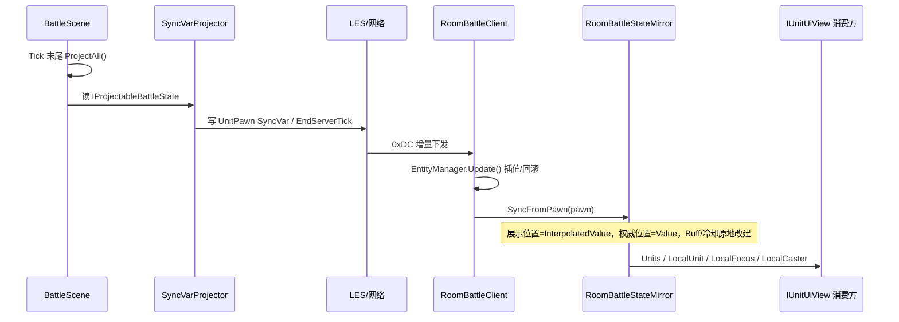

# 战斗状态同步

战斗权威状态的端到端同步链路：领域 → 投影 → 网络 → 客户端镜像 → UI，以及回放同契约消费。本文跨 `Battle.Logic`、`Battle.Entities`、`Client.Battle`、`Battle.Server`、`Replay` 多模块，描述整体工作方式。第三方库 LES 自身时序见 `libraries/lite-entity-system-update`，单模块职责见 `overview/04-client-battle`。

## 单一真相源

权威状态由 `BattleScene`（`Battle.Logic`）持有的领域实体 `BattleUnit` 决定，服务端与回放共用，不依赖网络载体。客户端不从网络侧推导逻辑，只做状态落点与展示。

## 投影契约

- `IProjectableBattleState`：供投影器读取领域只读状态。
- `IBattleProjector`：把状态写往外部载体，实现注入到 `BattleScene`。
- `SyncVarProjector`（服务端 `Battle.Server`）：读 `BattleUnit`，写 `UnitPawn`（LES 实体）的 SyncVars 与房间阶段；回放不注入投影器（`null`）。

`BattleScene.Tick` 末尾 `ProjectAll()` 触发投影。

## 投影规则

- 计数型字段（生命、位置、半径、读条剩余等）直接写 SyncVar，靠 LES 做增量 diff。
- 冷却 / Buff / 仇恨等 `SyncList`：内容比对后节流重建，避免每帧全量发送。
- 倒计时字段写**截止 tick**（`EndServerTick`），不逐 tick 推当前值；两端各自推算剩余。
- `MaxStacks`、`StackCount`、`DamageType` 等 Buff 字段随 Buff 条目一起写。

## 网络下发与客户端接收

- 通信走 LiteNetLib + LiteEntitySystem，协议头 `0xDC`。
- `OnNetworkReceiveInternal` 分流：
  - `ReliableMessageFrame` 可靠消息帧 → `BattleEventCoder` 解码为领域事件 → 存 `BattleEventLogStore` 并触发 `BattleEventsReceived`；
  - 其余 `0xDC` 帧 → `ClientEntityManager.Deserialize`。
- `EntityManager.Update()` 驱动 LES 实体同步与状态回放。

## 客户端战斗世界（领域回填）

客户端不经网络推导逻辑，在线端构建 `BattleScene`，把 `UnitPawn` SyncVar 回填为领域 `BattleUnit`（实现 `IUnitUiView`/`ISkillCasterView`），UI 统一从领域取数。

### 实体创建回调 `OnPawnEntityCreated`

1. 登记到 `_roomPawns`，订阅 `HealthChanged`/`UnitDied`/`FocusTargetChanged` 并转发为接口事件。
2. **先** `AddPawnUnit` 构建 `BattleUnit` 并注册，**再**触发 `OnUnitCreated` 事件，保证事件时刻领域单位已可查询。
3. 不注入 `MoveResolver`，不做本地移动预测，位移以服务端 SyncVar 为准。

### 每帧回填 `UpdateAfterPollEvents`

副本键同步后就绪时 `EnsureBattleScene` 构建 `BattleScene`（本地 `PhysicsMovementScene`，仅结构同构）；`EntityManager.Update()` 后，对每个 Pawn 调 `SyncUnit(pawn)` 回填领域 `BattleUnit`：

- 位置/朝向/生命/最大生命/半径/施法技能/读条剩余/全局冷却 ← SyncVar `Value`（服务端权威），不做插值；
- Buff/冷却从网络数据重建运行时壳（`ActiveBuff`/`CooldownEntry`），剩余秒数经 `EndTickToRemaining` 换算；
- 聚焦映射 `FocusByNetId` 每帧刷新。

### 截止 tick 换算

`SyncTickHelper.RemainingSeconds` 用客户端插值 `ServerTick` 与截止 tick 做 `SequenceDiff`（处理 16 位回绕）推算剩余秒数；服务端用自身 `Tick`。倒计时同步统一为截止 tick，避免逐帧推送当前值。

## 领域单位 → UI

`RoomBattleClient.Units`（`BattleScene.BattleUnits`，`IReadOnlyList<IUnitUiView>`，仅枚举、主线程更新）经 `BattleSessionContext.Units` 暴露；另提供 `LocalUnit`（展示）、`LocalFocus`（聚焦展示）、`LocalCaster`/`FindCaster`（`ISkillCasterView` 权威角色）供技能预判。UI 组件每帧直读 `IUnitUiView` 字段。

## 契约分层

- `IWorldPoseView`：碰撞半径 + 权威逻辑位置，供判定。
- `ISkillCasterView : IUnitCombatView, IWorldPoseView`：施法判定最小子集，`SkillCastValidator` 依赖。
- `IUnitCombatView : IUnitIdentityView, ICombatValuesView, ISkillSource`：公共面，`ISkillCasterView` 与 `IUnitUiView` 共享。
- `IUnitUiView : IUnitCombatView`：展示契约，`Position` 定义为展示/渲染位置，与判定权威位置语义分离。
- `IBattleUnitView : ISkillCasterView, ICombatStatsView, IHateActorView`：领域只读（服务端/AI/仇恨）。
- `IBuffUiView`：Buff 展示，`ActiveBuff` 与镜像 `MirrorBuff` 都实现它。

契约分层消除重复声明，UI 判定与展示各取所需。

## 回放链

`ReplayEngine` 构建 `BattleScene`（不注入投影器）每帧确定性重跑，直接读 `BattleUnit`（实现 `IUnitUiView`）供同一套展示契约消费，无网络与镜像层。

## 两链收敛

在线经「领域 → `BattleUnit` → `SyncVarProjector` → `UnitPawn` → 网络 → 镜像 `MirrorUnit` → UI」，回放「领域 → `BattleUnit` → UI」，最终都收敛到 `IUnitUiView`/`IBuffUiView`。在线多一层投影/反投影。

## 断线 / 重连

`ClearRoomSessionState` 调 `_mirror.Clear()`（清空单位、索引、聚焦、阶段、本地网络 ID），随连接状态重建为干净会话。
