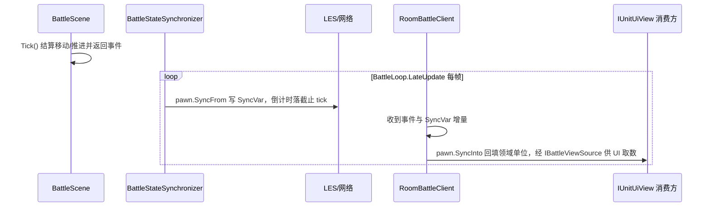

# 战斗状态同步

战斗权威状态从服务端到屏幕的端到端链：领域 → 投影 → 网络 → 领域回填 → UI，回放以同一展示契约消费。本文跨 `Battle.Logic`、`Battle.Entities`、`Battle.Client`、`Battle.Server`、`Replay`，只写这条链按什么次序走、错了出什么现象。

单模块机制不在本文：搬运规则、截止 tick 换算、视图契约分层见 `overview/battle`；每帧处理、收包分流、事件日志仓库见 `overview/client`；UI 侧取数装配见 `overview/godot`；LES 自身时序见 `libraries/lite-entity-system-update`；在线端预测的框架调查与缺陷编号（D5–D11）见 [client-prediction](client-prediction.md)。

## 单一真相源

权威状态由 `BattleScene`（`Battle.Logic`）持有的领域实体 `BattleUnit` 决定，服务端、在线与回放共用同一实现，不依赖网络载体。结算权威在服务端；在线端持本地 `BattleScene` 只作回填容器，当前不在在线端跑模拟。

## 通道两向

`UnitPawn.StateSync.cs` 上两个方向方法跨了三端：

- `SyncFrom`（领域 → 载体）只在服务端跑：`BattleStateSynchronizer` 由 `BattleLoop.LateUpdate` 在 `Tick` 之后逐单位调用，另写房间阶段。回放不投影，领域直读。
- `SyncInto`（载体 → 领域）只在在线端跑：`ClientBattleLoop.VisualUpdate` 每渲染帧按网络 ID 配对调用。

链上的传输是 LiteNetLib + LES，协议头 `0xDC`；`EntityManager.Update()` 驱动实体同步与状态回放。可靠事件帧与 LES 帧的分流在客户端接收侧，见 `overview/client`。

## 回填时点决定本端落后

回填落在 `EntityManager.Update` 开头，早于同一次调用后段把下行 diff 写进实体字段，展示读数恒比本端已收到的权威值旧一个渲染帧（D10）。

由此而来的落后量（下行单程 + 插值水位 + 播放欠账 + 回填时点）无法在本端消除：倒计时线上是绝对截止时刻、本端反算当前值，读出的剩余秒恒比权威多 `落后 tick / Tickrate`，128 Hz 下约 0.1–0.2 秒。施法判定由服务端权威兜底，当前决定不补偿。

冷却与 Buff 经回填进入领域 `RuntimeState`，回填通道独占它们：在线端不得本地改写。可否施放一律权威裁定，机制见 `overview/battle`。

## 到达次序约束

实体创建回调 `OnPawnEntityCreated` 只经 `AddPawnUnit` 注册领域单位，**注册在前、`OnUnitCreated` 在后**，保证事件时刻领域单位已可查询。事件流与 SyncVar 增量走两条通道（可靠帧与 LES diff），到达无相互保证，链上只做这一处排序承诺。

## 领域单位到 UI

`RoomBattleClient.Units`（`BattleScene.BattleUnits`，`IReadOnlyList<IUnitUiView>`，仅枚举、主线程更新）经 `IClientBattleSession` 由门面 `RoomSession` 交出，再经 `BattleSessionContext.Units` 暴露；同一契约另给 `LocalUnit` 与 `LocalFocus`。UI 组件每帧直读 `IUnitUiView` 字段，判定视图不进这条取数路径（见 `overview/battle` 的视图契约）。

## 回放链与两链收敛

`ReplayEngine` 构建 `BattleScene`（不投影）每帧确定性重跑，移动与施法意图经同一个输入门面 `BattleIntentHub` 注入，移动在 `BattleScene.Tick` 内与在线同序结算，无网络与投影层。引擎侧条目注入与游标见 `overview/replay`。

在线经「服务端领域 → `BattleUnit` → `UnitPawn.SyncFrom` → SyncVar → 网络 → `UnitPawn.SyncInto` 回填本地 `BattleScene` → UI」，回放经「服务端领域 → `BattleUnit` → 输入重放 → 本地结算 → UI」，最终都收敛到 `IUnitUiView`/`IBuffUiView`：差别在回放每帧本地结算，在线直接显示下行读数。

## 断线期间的链

断开玩家的单位载体不销毁，领域状态与投影照常推进下行，重连方按 `BaselineSync` 全量重建视图；解绑先于移除的原因见 `overview/battle`，状态机与收敛点见 [connection-reconnect](connection-reconnect.md)。
