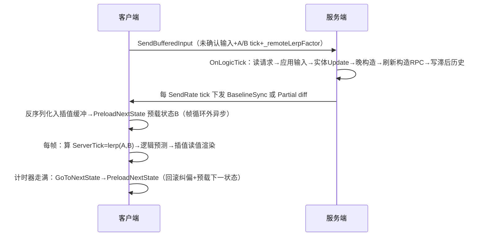

# LiteEntitySystem 更新时序

## 核心心智模型

LiteEntitySystem（LES）的更新时序由两条独立的驱动链构成：客户端每帧由 `ClientEntityManager.Update()` 驱动显示与预测，服务端每 tick 由 `ServerEntityManager.OnLogicTick()` 驱动权威计算。两条链通过上行输入与下行状态往返耦合，其内部蕴含两个关键机制：

- **插值**：让画面顺滑。客户端握着两个服务器权威快照——状态A（旧）与状态B（新），渲染时在两者间线性补间。只影响显示，不改逻辑，且只作用于**远端实体**。
- **预测与回滚**：纠正本地猜测。本地玩家的单位由客户端先“猜”着动，等服务器状态到达后，把猜测倒回服务器已确认的点、用真实输入重演，再继续预测。只作用于本地实体，不进入 A/B 插值缓冲。

一句话：**插值每帧算一次，回滚每前进一个状态算一次**；客户端在帧循环里插值、在推进状态时回滚。

## 两端共用主循环

`EntityManager.Update()`（基类）是两端共享的骨架：

```
算 VisualDeltaTime
  → 本地单例 VisualUpdate(dt)                [扩展点①]
累加器满一个 tick：
  → 本地单例 Update(dt)                      [扩展点②]
  → OnLogicTick()                            [扩展点③]
  → _tick++
累加器余量 → _lerpFactor
```

差异只在各自覆写的 `OnLogicTick()`，以及客户端额外套在骨架之外的插值/回滚逻辑。

## 一条网络往返

一次完整往返：客户端派出的输入被服务端消化后返回，客户端再据此插值/回滚。其中权威计算每往返一次，插值/回滚读值每渲染帧一次。



## 客户端时序

每帧 `Update()` 执行顺序如下，各细节分述。

### 每帧 Update 流水线

按 `ClientEntityManager.Update()` 一帧内的顺序：

1. 记 `_prevTick = _tick`，算本帧 `ServerTick = LerpSequence(stateA, stateB, _remoteLerpFactor)`。
2. 进入 `base.Update`（见“两端共用主循环”）：单例 `VisualUpdate`，循环内单例 `Update`→`OnLogicTick`→`_tick++`→`_lerpFactor`。
3. 本帧新输入补发：`if(_tick != _prevTick) SendBufferedInput()`。
4. A→B 中间事件：`_stateB.ExecuteRpcs(_stateA.Tick, BetweenStates)`→`ExecuteSyncCalls(_stateB)`，播这段时间的 RPC、生成实体。
5. 状态推进：计时器走满则 `GoToNextState()`→`PreloadNextState()`，算 `_remoteLerpFactor`。
6. 渲染读值：逐实体 `VisualUpdate()`（读 `InterpolatedValue`）。

### 逻辑 tick：先快照，再预测

`OnLogicTick()`（客户端覆写）：

1. 把本 tick 输入存进 `_storedInputHeaders`（记录当时 A/B tick 与 `_remoteLerpFactor`），交给输入控制器。
2. 遍历实体：若是本帧第一个逻辑 tick（`_tick == _prevTick`），对本地/本地受控实体先 `SetInterpValueFromCurrentValue` 存下**更新前的值**，再 `entity.Update()` 做预测。
3. 本地单例晚更新。

**为什么要先快照**：预测会立刻改写字段值；先把旧值存为插值起点，渲染时才能从旧值平滑滑到新值。

### 插值线：读 A/B 快照

服务器按固定节奏发来世界状态快照，客户端并不直接全用，而是握着最近两个权威快照：

- 状态A（旧，正在播）与状态B（新，准备播），都来自网络下行，是服务器算好的确定性状态。
- 渲染时在 A、B 间平滑补间，位置从 A 平滑滑到 B。此线只服务**远端实体**。

### 回滚线：GoToNextState()

**触发时机**：① 插值计时器走满，该前进到下个状态；② 网络缓冲塞满被迫快进。

一次完整顺序：

1. 扣掉插值计时器，记下回滚起点。
2. 收集被修改过的本地预测实体为待回滚队列，切到 `PredictionRollback` 模式。
3. **倒回**：对每个待回滚实体回退到最后一次服务器确认的值，并触发自定义回滚回调。
4. **重演已确认输入**：把服务器已处理到的输入逐条重放，让实体回到服务器认可的状态。
5. **提交新状态**：A = B；执行进入新状态的 RPC、把 B 的字段真正写进实体。
6. **清理**：删掉服务器已确认生成的预测实体、待删除实体。
7. **重放未确认输入**：本地玩家尚未被服务器确认的新输入继续重放，末条命令先保存插值起点，保证预测结果能平滑接上。
8. 恢复 `Normal` 模式。

**作用**：让本地猜测始终追着服务器权威跑，偏差被自动纠正，同时不打断显示。

**重放范围**：三步筛选决定谁被重演——实体须在待回滚队列中、`IsLocalControlled` 为真、且在 `AliveEntities` 内。进队列的唯一途径是它本轮有 predicted 字段被写过，字段由 `EntityFieldChanged` 登记，因此**写值本身就是登记动作**；未写过的实体不会被重演。远端实体虽入队做字段倒回，但不参与重演，重放期间他人值保持不动、不随 `_tick` 演进。`LocalSingleton` 的 `Update`/`LateUpdate` 不在重放路径内，跨 tick 的可复现模拟必须落在 `entity.Update()` 里。重放中 `EntityManager.Tick` 被改写为该步的历史 tick，结束后还原，`InRollBackState` 为真，一切非确定性副作用须据此门控。

### 两个进度因子

- `_remoteLerpFactor`：**远端实体**在“服务器状态A → 状态B”两个权威快照间的补间进度（0 到 1）。
- `_lerpFactor`：**本地预测实体**在当前逻辑 tick 内补间的进度，与服务器 A/B 无关。

### 一个字段的两种读数

`SyncVar` 有两种读数：

- `Value`（逻辑值）：整数 tick 上的确定结果，由用户 `entity.Update()` 算出，供逻辑判定与回滚重演。
- `InterpolatedValue`（插值值）：供渲染读取的显示值，按实体归属用不同代入方向与因子计算：

| 归属                                             | 代入                                                          | 插值目标来源                                  |
| ------------------------------------------------ | ------------------------------------------------------------- | --------------------------------------------- |
| 远端实体（`IsLocalControlled == false`）         | `lerp(_value 状态A, _interpValue 状态B, _remoteLerpFactor)`   | `_interpValue` 由状态B预载写入                |
| 本地/本地受控实体（`IsLocalControlled == true`） | `lerp(_interpValue 预测前快照, _value 预测当前, _lerpFactor)` | `_interpValue` 由预测前或回滚重放末条命令写入 |

线性插值统一为 `lerp(a, b, t) = a + (b - a) * t`。内置标量用 `Utils.Lerp`；自定义 `Vector2` 用 `VectorMath.Lerp`，在实体类型注册处通过 `EntityManager.RegisterFieldType<Vector2>(VectorMath.Lerp)` 注册。

**读取时机**：`InterpolatedValue` 由两个进度因子（`_lerpFactor`、`_remoteLerpFactor`）与端点 `_interpValue` 共同决定，这两者在帧内只在特定时刻才更新到位，因此只在以下两种场合读才正确。

- **渲染**：在 `entity.VisualUpdate()` 内读。框架在每帧 `ClientEntityManager.Update()` 末尾调用它，此时 `_lerpFactor` 与 `_remoteLerpFactor` 都已更新为本帧进度，得到权威 A/B 或本地预测的补间显示值。
- **判定**：在滞后补偿窗口内读，即 `EnableLagCompensation(player)` ↔ `DisableLagCompensation()` 之间。此时 `GetInterpolatedValue` 命中 `IsLagCompensationEnabled && IsEntityLagCompensated` 分支，直接返回写回历史、按玩家回溯的 `Value`，让命中检测与玩家视觉一致。

其余场合（逻辑 tick 内、非补偿态）读，两个进度因子仍是上一次 `Update()` 的残留值，得到错位/迟到的补间值，不应作为显示或判定依据。服务端 `InterpolatedValue` 恒等于 `Value`，但要回溯到玩家可见位置，仍需先启用滞后补偿。

滞后补偿的读数形状：带 `LagCompensated` 的字段每应用一个状态写一格滚动历史，槽位按该状态 tick 取模，缓冲多出一格用于暂存原值。`Enable` 把字段覆盖为按发起者的 A、B 两格与其记录进度混合的历史值，`Disable` 从暂存格还原。因此窗口是一次性的：开、问一次、关。不能整段模拟都开着，也不能指定任意 tick 回溯——两格之外的历史已被环形覆盖，且索引参数不对外可读；请求时刻超出状态区间时只记 `LagCompensationMiss` 日志并放弃补偿。窗口内 `InterpolatedValue` 直返 `Value`，展示逻辑不得落进这个作用域。它是判定层机制，不提供连续模拟所需的历史时间轴。

### 客户端实体钩子可达性

`entity.Update()` 与 `entity.VisualUpdate()` 都只遍历 `AliveEntities`。成员资格在构造时由 `IsEntityAlive` 判定：需要 `Updateable` 标记，且服务端全量收集，客户端只收本地生成的预测实体或带 `UpdateOnClient` 的实体。本地控制关系晚于构造建立，归属变化时由 `AddOwned`/`RemoveOwned` 动态进出队列。

| 类标记 | 服务端 | 客户端 |
|---|---|---|
| 无标记 | 不进队列，两个钩子都不跑 | 同左 |
| `Updateable` | 进 | 仅本地生成或本地控制的实体进 |
| `UpdateOnClient` | 进 | 全部进 |

推论：客户端要给非本地控制的实体挂渲染钩子，必须显式加 `UpdateOnClient`；加了之后又要在 `Update` 首行早退远端实体，否则同一份逻辑在两端重复执行。只依赖 `LocalSingleton` 的 `VisualUpdate` 不受此表约束，但它拿不到回滚重放。

## 服务端时序

服务端走基类的固定 tick 循环，覆写 `OnLogicTick()`。它没有插值/回滚/渲染读值：不维护 A/B 缓冲、不消费两个插值因子、不调用 `VisualUpdate()`。服务端 `InterpolatedValue` 直接等于 `Value`。

### 每个逻辑 tick

1. 处理待处理的客户端请求，交给对应控制器。
2. 应用玩家输入，对玩家拥有的控制器应用输入帧。
3. 更新实体：跳过已销毁的，必要时可加 try/catch 保护。
4. 晚构造，本地单例晚更新。
5. 刷新本 tick 生成的构造 RPC。
6. 写滞后补偿历史。

### 状态下发与序列化

按发送节奏（`_tick % SendRate == 0` 且有玩家）对每个玩家发送：

- **首次/重同步**：发 `BaselineSync`，把全量状态可靠地发给落后或刚连接的玩家；重同步复用已排队的 RPC 与增量数据。发送后把状态A/B tick 对齐到当前 tick。
- **Active**：做 Partial diff 同步，只把本 tick 变化过的实体按增量下发，超 MTU 则分包。
- 玩家长期跟不上会转回重同步兜底。

每个实体对应一个状态序列化器，负责编码/解码字段，并按玩家同步分组、仅所有者等条件过滤下发；客户端逐个用收到的状态重建世界。

## 两端扩展点清单

### 客户端（更新/回滚流程内可达）

| 扩展点                                                                           | 时机                           | 用途                 |
| -------------------------------------------------------------------------------- | ------------------------------ | -------------------- |
| 单例 `VisualUpdate` / `Update` / `LateUpdate`                                    | 每帧 / 每 tick 前 / 每 tick 末 | 与实体无关的全局更新 |
| `OnLogicTick`                                                                    | 每个逻辑 tick                  | 覆写预测入口         |
| `ApplyPendingInput`                                                              | 每 tick 输入分派               | 读取本地预测输入     |
| `entity.Update`                                                                  | 每 tick                        | 实体确定性逻辑       |
| `entity.VisualUpdate`                                                            | 每帧                           | 渲染读值             |
| `OnConstructed` / `OnLateConstructed`                                            | 生成实体时                     | 实体初始化           |
| `OnBeforeRollback` / `OnRollback`                                                | 回滚前 / 回滚后                | 自定义回滚           |
| `SyncableFieldCustomRollback.OnRollback`                                         | 字段回滚                       | 自定义字段回滚       |
| `BindOnChange`（`ExecuteOnPrediction`/`ExecuteOnSync`/`ExecuteOnRollbackReset`） | 字段变化时                     | 字段级通知           |
| RPC（`BetweenStates`/`OnNextState`/`FirstSync`）                                 | 对应状态切点                   | 事件播报             |
| `EnableLagCompensation`                                                          | 滞后补偿启用                   | 历史读写             |

### 服务端（每 tick 可达）

| 扩展点                                | 时机          | 用途           |
| ------------------------------------- | ------------- | -------------- |
| `OnLogicTick`                         | 每个逻辑 tick | 覆写权威入口   |
| `ReadClientRequest`                   | 请求分派      | 读取自定义请求 |
| `ApplyIncomingInput`                  | 输入应用      | 应用玩家输入   |
| `entity.Update` / `SafeUpdate`        | 每 tick       | 权威实体逻辑   |
| `OnConstructed` / `OnLateConstructed` | 生成实体时    | 实体初始化     |
| 单例 `LateUpdate`                     | 每 tick 末    | 全局晚更新     |
| RPC                                   | 下发给客户端  | 事件播报       |
| 滞后补偿 `WriteHistory`               | 每 tick       | 写历史供回溯   |
